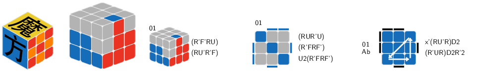
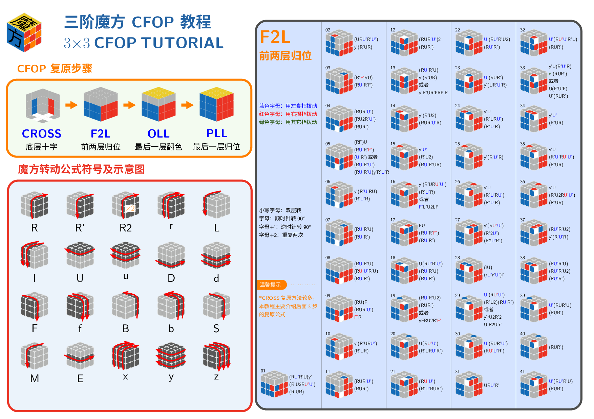
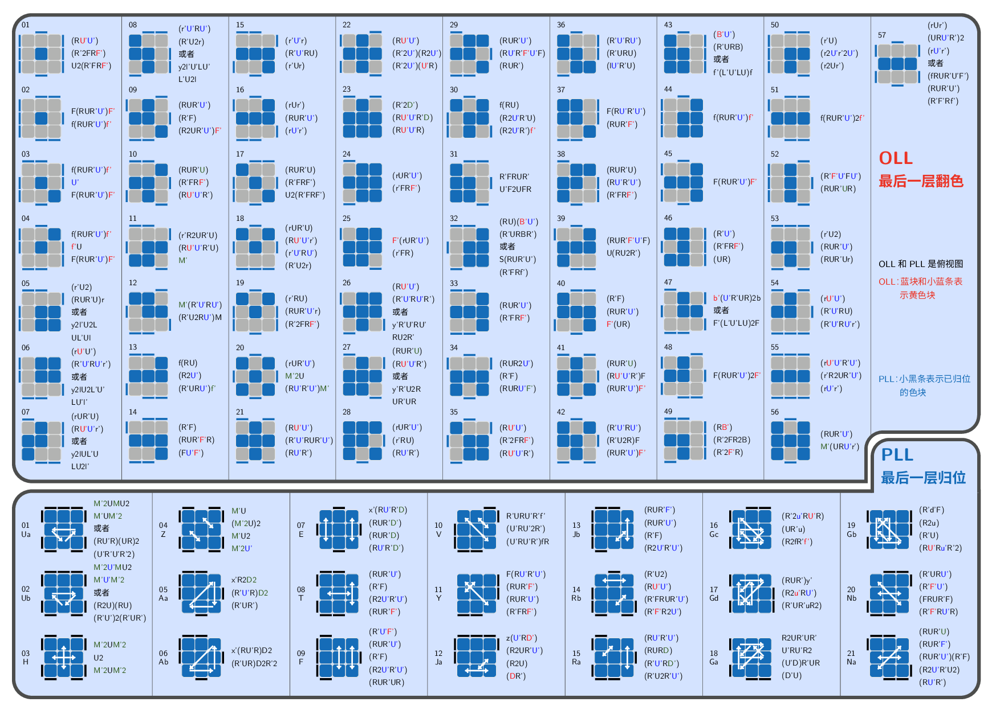

# cube - 三阶魔方绘制 LaTeX 宏包

[](https://github.com/rockyzhz/cube)

`cube` 是一个用于绘制三阶魔方图形的 LaTeX 宏包，提供了简单的命令来表示魔方的各个面、块和颜色，支持 CFOP 公式的图形化展示。

## 功能特性

- **魔方三维绘制**：支持正二等轴测投影、正等轴测投影、斜投影等多种视角
- **颜色系统**：内置白色、黄色、蓝色、绿色、橙色、红色、黑色等颜色映射
- **公式可视化**：支持 FLL、OLL、PLL 等 CFOP 公式的图形化展示
- **箭头绘制**：提供魔方公式符号的箭头指示绘制功能
- **coffin 封装**：命令结果可直接用于 coffin 排版

## 快速开始

```latex
\documentclass{standalone}
\usepackage{ctex}
\usepackage{cube}

\begin{document}

% 绘制 Logo 和三面视图的魔方
\CubeLogo
\Cube{----b}{r--r-}{-----b---}

\end{document}
```

保存为`test.tex`，然后用`xelatex`或者`lualatex`去编译该文件
```bash
xelatex test.tex
```
或者
```bash
lualatex test.tex
```
可以得到：



## 完整的三阶魔方 CFOP 教程效果：





## 文件说明

| 文件 | 说明 |
|------|------|
| `cube.sty` | 宏包核心文件 |
| `cube.pdf` | 宏包使用说明文档 |
| `cube.tex` | 宏包使用说明文档源文件 |
| `CFOP.pdf` | 三阶魔方 CFOP 魔方教程 |
| `CFOP.tex` | 三阶魔方 CFOP 魔方教程源文件 |

## 依赖环境

- LaTeX2e
- TikZ (含 3d、calc、math、arrows.meta 库)
- xcoffins
- expl3 + l3regex-supplement
- xparse

## 作者

张泓知

## 许可证

[LPPL v3](https://www.latex-project.org/lppl/lppl-3.html)
